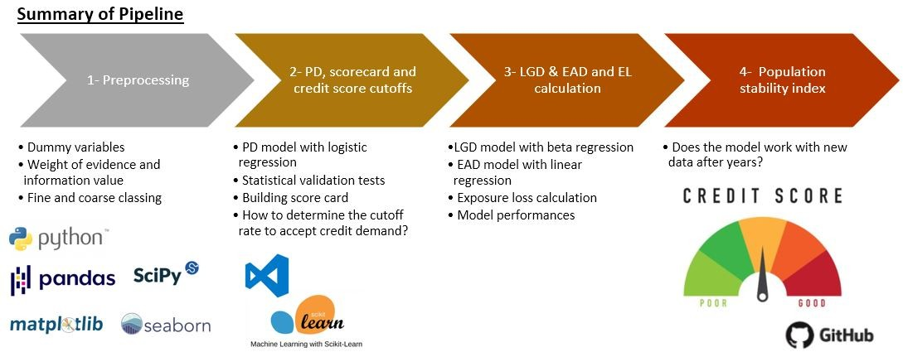
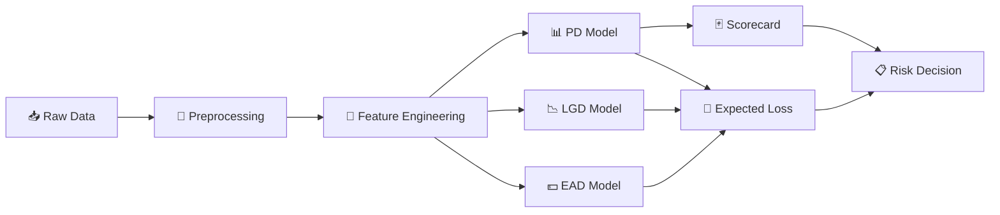
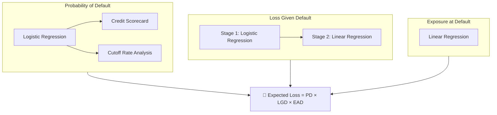
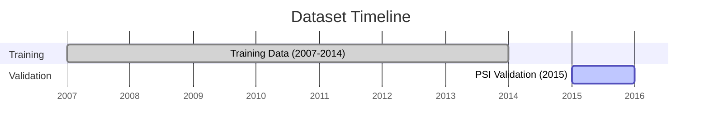
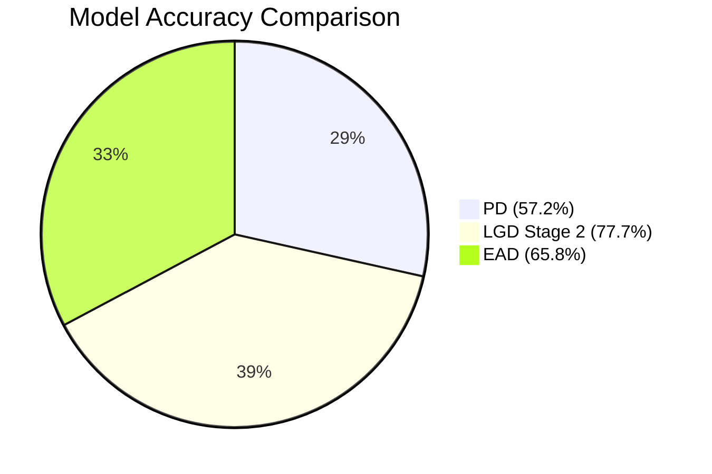
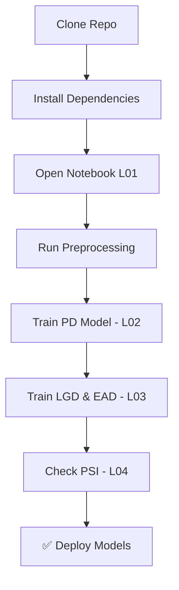

<p align="center">
  
</p>

<h1 align="center">💰 Credit Risk Modelling</h1>

<p align="center">
  <strong>End-to-end calculation of PD, LGD, EAD & Expected Loss using Machine Learning in Python</strong>
</p>

<p align="center">
  
  
  
  
  
</p>

---

## 📋 Table of Contents

- [About the Project](#-about-the-project)
- [Key Features](#-key-features)
- [Pipeline](#-pipeline)
- [Notebooks](#-notebooks)
- [Dataset](#-dataset)
- [Model Performance](#-model-performance)
- [Deliverables](#-deliverables)
- [Project Structure](#-project-structure)
- [Getting Started](#-getting-started)
- [Technologies](#-technologies)
- [License](#-license)
- [Author](#-author)

---

## 🧠 About the Project

Credit risk modelling is critical for financial institutions — it quantifies the risk that a borrower will fail to repay a loan, credit card, or other debt obligation. This project provides a **complete, Basel II-compliant pipeline** to model credit risk using machine learning.

The goal is to build production-ready models that output:
- A **credit scorecard** for daily use
- An **expected loss calculation** pipeline

> This project includes revisions and additions built on top of the credit risk course on [365 Data Science](https://365datascience.com/courses/credit-risk-modeling-in-python/).

---

## ✨ Key Features

| Feature | Description |
|---------|-------------|
| 🔄 **Preprocessing** | Fine & coarse classing, dummy variable encoding |
| 📊 **PD Model** | Logistic regression-based Probability of Default |
| 🃏 **Scorecard** | Practical credit scorecard exported as CSV |
| 📉 **LGD Model** | Two-stage beta regression for Loss Given Default |
| 💵 **EAD Model** | Linear regression for Exposure at Default |
| 🧮 **Expected Loss** | Full EL calculation combining PD × LGD × EAD |
| 🔍 **PSI Check** | Population Stability Index for model monitoring |

---

## 🔁 Pipeline

<p align="center">
  
</p>

### End-to-End Flow



### Model Training Strategy



### Data Split & Validation



---

## 📓 Notebooks

| # | Notebook | Description |
|---|----------|-------------|
| 01 | `L01_LoanData_CreditRisk_Preprocessing_PD` | Data preprocessing & feature engineering |
| 02 | `L02_LoanData_CreditRisk_PD_Scorecard_Cutoffs` | PD modelling, scorecard creation & cutoff analysis |
| 03 | `L03_LoanData_CreditRisk_LGD_EAD_and_Expected_Loss` | LGD, EAD modelling & expected loss calculation |
| 04 | `L04_LoanData_CreditRisk_PSI_check` | Population Stability Index validation |

---

## 📂 Dataset

**Source:** [Lending Club Loan Data (Kaggle)](https://www.kaggle.com/wendykan/lending-club-loan-data/version/1)

- **800,000+** consumer loans issued between 2007–2015
- **Training set:** 2007–2014 data
- **Validation set:** 2015 data (used for PSI checks and model stability testing)

---

## 📈 Model Performance

| Model | Algorithm | Accuracy | AUC-ROC |
|-------|-----------|----------|---------|
| **PD** | Logistic Regression | 0.572 | 0.684 |
| **LGD – Stage 1** | Logistic Regression | 0.572 | 0.684 |
| **LGD – Stage 2** | Linear Regression | 0.777 | — |
| **EAD** | Linear Regression | 0.658 | — |



> ⚠️ These are baseline results. Further optimization (hyperparameter tuning, ensemble methods) can improve performance.

---

## 📦 Deliverables

1. ✅ Credit **Scorecard** — easy-to-interpret, Basel II compliant
2. ✅ **Cutoff analysis** — impact of thresholds on borrower acceptance rates
3. ✅ Trained **LGD, EAD & EL** models
4. ✅ **PSI monitoring** schema for model drift detection

---

## 🗂 Project Structure

```
Credit_Risk_Modelling/
├── 📁 notebooks/          # Jupyter notebooks (L01–L04)
├── 📁 src/                # Helper functions & utilities
├── 📁 data/               # Datasets & scorecard output
├── 📁 models/             # Serialized trained models (.sav)
├── 📄 requirements.txt    # Python dependencies
├── 📄 LICENSE             # MIT License
└── 📄 README.md           # You are here
```

---

## 🚀 Getting Started

### Prerequisites

- Python 3.8+
- pip or conda

### Installation

```bash
# 1. Clone the repository
git clone https://github.com/reetika0104/Credit_Risk_Modelling.git
cd Credit_Risk_Modelling

# 2. Install dependencies
pip install -r requirements.txt
```

### Workflow



### Alternative: Google Colab

You can run this project directly on [Google Colab](https://colab.research.google.com) — no local setup required. Just load the repo and start running notebooks.

---

## 🛠 Technologies

| Tool | Version |
|------|---------|
| Python | 3.8 |
| Scikit-Learn | 1.0.2 |
| NumPy | latest |
| Pandas | latest |
| Matplotlib | latest |
| Seaborn | latest |
| SciPy | latest |
| Jupyter Notebook | 6.4.12 |

---

## 📄 License

Distributed under the **MIT License**. See [`LICENSE`](LICENSE) for more information.

---

## 👤 Author

<p align="center">
  
</p>

<p align="center">
  <strong>Om Singh</strong><br/>
  <a href="https://github.com/reetika0104">
    
  </a>
</p>

<p align="center">Made with ❤️ in India 🇮🇳</p>
